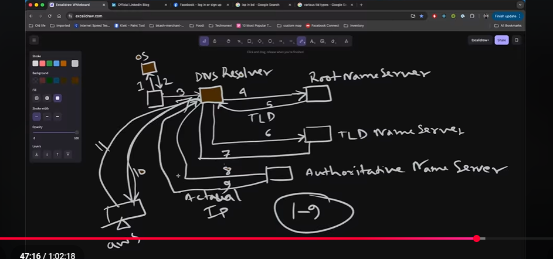
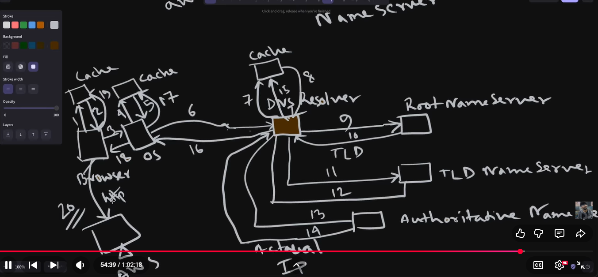

https://blog.linkedin.com

https - schema or protocol
blog - sub domain
linkedin - domain
.com - top level domain

Domain -> get the IP is called Resolation -> Resolve 

first check browser cache then os cache then ISP Server(DNS Resolver ) then Root Server - TLD Namespace -,> Authoritative Name Server .
