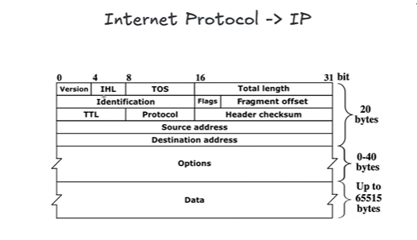

L 3

Version -> ip4 or ip6 
IHL - Internet Header Length
TOS - Type of Service - Now it called DSCP (6 byte) + ECM (2 bye)

Identification - 

Flag -
        3 flags 
                DF- Dont fragment
                MF- more fragment - There are more fragment or you can create more fragments
                reserved- 

        Fragment Offset - 

        Source Address - Protocol - Like ip - 8  8  8  8 -> Thats why ip 32 bit (ip44)

        L2 Router, L3 Router, Switch, Hub etc......